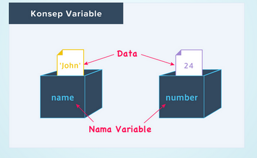
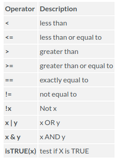
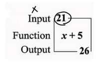

```{r setup, include=FALSE}
knitr::opts_chunk$set(echo = TRUE)
```

# 1. Pengenalan
## Pengenalan R

R merupakan bahasa yang digunakan dalam komputasi statistik.

{width=40%}

R bisa digunakan untuk membuat model linier dan nonlinier, hipotesis test, visualisasi, time series, klasifikasi, web-apps, pemetaan dan lain-lain.

Kenapa harus pakai R?

1. Gratis / Open Source

2. Packages / Library yang banyak

3. Digunakan oleh industri

4. Komunitas Besar

## Case sensitif

Pada bahasa R, huruf kapital dan non kapital dianggap berbeda. Contoh angka berbeda dengan Angka berbeda pula dengan ANGKA

```{r case}
"angka" == "Angka"
```
```{r sensitif}
"angka" == "angka"
```
Hasil FALSE menandakan objek berbeda, sedangkan TRUE menandakan objek sama

## Komentar

Komentar digunakan untuk memberikan penjelasan pada program. Komentar tidak akan mempengaruhi jalannya program. Pada bahasa R semua text yang berada di di belakang # akan dianggap komentar dan tidak akan dieksukusi

```{r komen1}
# ini adalah komentar
# 1 + 1
```

Kode diatas tidak menghasilkan output.

```{r komen2}
# ini adalah komentar
1 + 1
```
baris 1 + 1 dieksekusi dan menghasilkan output 2

## help

Setiap fungsi di R memiliki dokumentasi yang berisi cara penulisan, parameter dan penjelasan-penjelasan lainnya. misal mean adalah fungsi untuk mencari nilai rata-rata. Jika ingin menampilkan dokumentasi mean ketikkan

```{r dok mean1}
help("mean")
```

atau 

```{r dok mean2}
?mean
```

## Say Hello World
```{r hello}
print('Hello World')
```

# 2. Operator pada R

Operator aritmatika

+ tanda + adalah penjumlahan
+ tanda - adalah pengurangan
+ tanda / adalah pembagian
+ tanda * perkalian
+ tanda ^ pangkat
+ tanda %% modulos, sisa bagi

```{r aritmatika}
print('1 + 1 sama dengan')
1 + 1

print('2 - 3 sama dengan')
2 - 3

print('8/3 sama dengan')
8/3

print('9 * 0.5 sama dengan')
9*0.5

print('6 ^ 9 sama dengan')
6^9

print('9 %% 3')
9%%3
```

### tambahan operator

```{r operator :}
numbers = c(1:7)
numbers
```

# 3. Variabel

Variabel tempat untuk menyimpan sebuah nilai

{width=40%}

Membuat variabel kita memerlukan operator assigmnent

```{r variabel}
number <- 24

print(number)
print(number + 2)
```
```{r variabel2}
name <- 'John'

print(paste('Nama saya', name, 'umur saya', number - 2, 'tahun'))
```
Operator assigment

```{r variabel3}
name1 <- 'John' # tapi ini yang disarankan untuk di pake, RStyle
name2 = 'John'
name3 <<- 'John'
'John' -> name4
```

### Penamaaan Variabel

+ Diberi nama yang jelas, sesuai dengan isinya.

Sebagai contoh akan lebih mudah dibaca jika menulis:

umurku = 22

dibanding

x = 22

Meskipun maksud x adalah umurku

### Penamaaan Variabel

+ Tidak diawali angka atau _

```
_x = 3

Error: unexpected input in "_"
```

### Penamaan variabel

+ jangan menggunakan tanda operasi untuk penghubungan atau tanda spasi. Sebagai pengganti gunakan tanda _ sebagai penghubungan
+ disarankan menggunakan huruf kecil, menggunakan Snake case (stylized as snake_case)

```{}
umur-ku = 20
Error in umur - ku = 20 : object 'umur' not found
```

### Memasukkan banyak nilai pada variabel

Tentu tidak efetif jika menulis kode secara berulang seperti ini

```{r variabel5}
food1 <- 'banana'
food2 <- 'orange'
food3 <- 'grape'

print(food1)
print(food2)
print(food3)
```
Lebih baik di tulis seperti ini

```{r variabel6}
# lebih baik di tulis seperti ini

foods = c('banana', 'orange', 'grape')
print(foods)
```


# 4. Percabangan

Percabangan adalah fitur dari bahasa pemrograman yang melakukan perhitungan atau tindakan yang berbeda tergantung pada apakah kondisi boolean yang ditentukan pemrogram mengevaluasi benar atau salah.

Kondisi boolean:

* TRUE, kondisi benar

* FALSE, kondisi salah


```{r logika}
x = 4
y = 9

x < y
y <= x
```

```{r logika2}
x > y
y >= x
```
```{r logika3}
x == y
y != x
```

```
## Percabangan

Percabangan adalah cara yang digunakan untuk mengambil keputusan apabila di dalam program
dihadapkan pada kondisi tertentu. Contoh kita ingin mencetak 'Anda lulus ujian' jika nilai 
yang di peroleh >= 70

if ( __kondisi__ ){ 
    __statment__ 
}

Logika nya statement akan di eksekusi jika berniali TRUE (benar)
```

## IF
```{r logika4}
nilai <- 70
if(nilai > 70){
    print('Anda lulus ujian')
}
```

## if else
```{r logika5}
nilai <- 70
if(nilai > 70){
    print('Anda lulus ujian')
} else{
  print('anda tidak lulus ujian')
}
```

## if elseif else
```{r logika6}
nilai <- 70
if(nilai > 70){
    print('anda lulus ujian')
} else if( nilai == 70){
    print('anda tidak lulus ujian, tapi boleh remedian')
} else{
    print('anda tidak lulus ujian')
}
```
## Latihan
Buat program percabangan dengan kondisi

+ jika nilai > 80 cetak "A"

+ jika 70 < nilai <= 80 cetak "B" 

+ jika nilai 50 < nilai <=70 cetak "C"

+ Selain itu cetak "D"

# 5. Perulangan

Perulangan atau yang sering disebut dengan “looping”, merupakan proses yang dilakukan secara berulang-ulang dalam batas yang telah ditentukan.

Contoh jika kita ingin membuat tabel perkalian 9.

Cara manual
```{r loop1}
print(paste('9*1 =', 9*1))
print(paste('9*2 =', 9*2))
print(paste('9*3 =', 9*3))
print(paste('9*4 =', 9*4))
print(paste('9*5 =', 9*5))
print(paste('9*6 =', 9*6))
print(paste('9*7 =', 9*7))
print(paste('9*8 =', 9*8))
print(paste('9*9 =', 9*9))
print(paste('9*10 =', 9*10))
```
Cara looping

```{r loop2}
numbers <- c(1:10)

for(i in numbers){
    print(paste0('9*', i, ' = ', 9*i))
}

```
Contoh lain

```{r loop3}
numbers = c(1:10)
perkalian = c()
perkalian
```

Mengisi variabel perkalian
```{r loop4}
for(i in numbers){
    perkalian[i] = 9*i
}
perkalian
```
## Perulangan dengan break

Proses looping akan berhenti jika i sama dengan 5

```{r loop5}
numbers = c(1:10)
perkalian = c()
for(i in numbers){
  perkalian[i] = 9*i
  if(i == 5){
    break
  }
}
perkalian
```
## Perulangan dengan

Proses looping akan di next, di lewati pada kondisi i sama dengan 5

```{r loop6}
numbers = c(1:10)
perkalian = c()
for(i in numbers){
  if(i == 5){
    next
  }
  perkalian[i] = 9*i
}
perkalian
```
### Membuat program angka ganjil-genap

```{r loop7}
numbers <- c(1:10)
for(i in numbers){
    if(i %% 2 == 0){
        print(paste(i, 'adalah bilangan genap'))
    } else{
        print(paste(i, 'adalah bilangan ganjil'))
    }
}
```

# 6. Fungsi

Fungsi bahasa pemrograman yaitu memerintah komputer untuk mengolah data sesuai dengan alur berpikir yang kita inginkan.

{width=40%}

### Penulisan fungsi

#### cari 1
```
seper_x <- function(x) 1/x
```

### cara 2
```
seper_x <- function(x){
    1/x
}
```
### Fungsi tanpa parameter

```{r fungsi1}
hay <- function(){
  print('hello')
}
```

### Fungsi dengan parameter

```{r fungsi 2}
luas_segitiga <- function(alas, tinggi){
  1/2 * alas * tinggi
}

luas_segitiga(5, 9)
```

### Funsgi dengan parameter yang di inisialisasi

```{r fungsi 3}
luas_segitiga <- function(alas = 2, tinggi = 4){
  1/2 * alas * tinggi
}
luas_segitiga()
```
# 7.Packages

Packages pada dasarnya adalah fungsi yang sudah di program oleh orang lain dan kita gunakan.

Untuk menggunakan packages kita perli menginstallnya terlebih dahulu

```
install.packages('nama_packages')
```

Contoh menginstall packages ggplot2

```
install.packages('ggplot2')
```

Untuk load packages agar bisa digunakan tuliskan kode berikut

```{r load}
library(ggplot2)
```

Maka packages siap digunakan

```{r ggplo2, fig.height=3}
ggplot(iris, aes(Sepal.Length, fill = Species)) +
  geom_density()
```