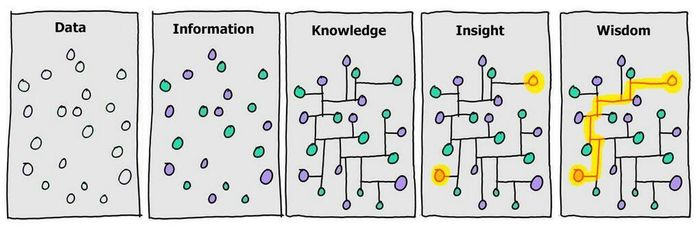
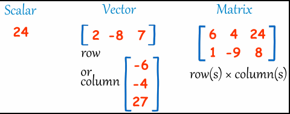
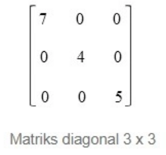

```{r setup, include=FALSE}
knitr::opts_chunk$set(echo = TRUE)
```

# Data



Contoh

Data = air jatuh dari langit Informasi = Jakarta hujan Knowledge = Jika jakarta hujan, maka akan macet dan banjir Wisdom = Jangan keluar rumah jika tidak mendesak

Pada bahasa R, data adalah objek yang memiliki suatu atribut dan berbagai fungsionalitas. Sifat data ditentukan oleh type data dan mode data. Ada berbagai type data yang dikenal oleh R,antara lain vektor, matriks, list, data frame, array, dan factor. Pada kesempatan kali ini akan di bahas beberapa type data

# Vektor

Vektor dibuat dengan menggunakan fungsi c() (concatenate)

```{r vektor}
#membuat vektor numerik
vektor_1 <- c(15,21,32,43,51)
vektor_1
```

```{r vektor karakter}
#membuat vektor karakter
vektor_2 <- c('terima kasih', 'thank you', 'gracias', 'vielen dank')
vektor_2
```

Kita juga dapat memberi nama untuk setiap nilai pada vektor

```{r vektor nama}
vektor_3 <- c('idn' = 'terima kasih', 'eng' = 'thank you', 
              'spn' = 'gracias', 'ger' = 'vielden dank')
vektor_3
```

Bisa juga ditulis seperti ini

```{r vektor nama2}
vektor_4 <-  c('terima kasih', 'thank you', 'gracias', 'vielen dank')
names(vektor_4) <- c('idn', 'eng', 'spn', 'ger')
vektor_4
```

## Slicing

Slicing merupakan teknik memilih data dari sebuah set data. Sebelumnya kita memiliki vektor_1 yang berisi nilai numerik. Setiap nilai pada vektor memiliki urutan / index yang di mulai dari 1 hingga sesuai banyaknya isi vektor. Untuk melakukan slicing kita menggunakan [] lalu mengisi index vektor.

```{r vektor slicing}
vektor_1

# memilih data ke 3 pada vektor_1
vektor_1[3]

# memilih data ke 3 sampai ke 5 pada vektor_1
vektor_1[3:5]

# memilih semua data pada vektor_1 kecuali data ke 2
vektor_1[-2]

# memilih semua data pada vektor_1 kecuali data ke 2
vektor_1[6]
```

Hasil terkahir NA karena memang tidak ada nilai pada index ke 6 sebab panjang vektor hanya sampai 5

## Merubah isi vektor

Sebelumnya kita memiliki vektor_2 yang merupakan ucapak terima kasih pada beberapa bahasa.

```{r vektor ganti}
vektor_2

# mengganti nilai ke 2 pada vektor_2

vektor_2[2] <- 'Arigatogozaimashita'
vektor_2
```

Dari output di atas dapat dilihat "thank you" berubah menjadi "Arigatogozaimashita"

## menambah panjang vektor

vektor_2 memiliki panjang 4

```{r vektor panjang}
length(vektor_2)
```

Misal kita ingin menambah panjang vektor_2 menjadi 7

```{r vektor panjang 2}
vektor_2[5:7] <- c('kkhxbkhun', 'spasibo', 'kia ora')
vektor_2
length(vektor_2)
```

Perlu di ingat jika vektor hanya bisa menyimpan data dalam satu tipe, numerik semua atau karakter semua

```{r vektor satu tipe}
vektor_5 <- c(1, 2, 3, "a")
vektor_5
```

Pada output di atas kita lihat angka 1, 2 dan 3 otomatis di ubah menjadi karakter.

## Perhitungan pada vektor

Kita bisa melaukukan perhitungan atau operasi aritmatika pada vektor dengan skalar ataupun dengan vektor pula.

```{r vektor hitung}
vektor_6 <- c(0,8,4,6)
vektor_6
vektor_6 + 4
```

Untuk operasi aritmatika pada vektor dengan vektor, pastikan vektor-vektor yang digunakan memiliki panjang yang sama. Nilai pada vektor akan di operasikan berdasarkan kesamaan indeks.

```{r vektor hitung 2}
vektor_6 <- c(0,8,4,6)
vektor_7 <- c(6,8,1,2)
vektor_7 * vektor_6

```

# Matriks

Sederhananya matriks adalah kumpulan vektor yang kemudian memiliki beberapa baris dan kolom.



## Membuat matriks dengan menggabung vektor

```{r vektor matriks}
vektor_1 <- c(14,24,81,42)
vektor_2 <- c(40,76,71,23)
vektor_3 <- c(0,1,0,1)
```

Menggabung berdasarkan kolom

```{r gabung kolom}
matriks_1 <- cbind(vektor_1, vektor_2, vektor_3)
matriks_1
```

Menggabung berdasarkan baris

```{r gabung baris}
matriks_2 <- rbind(vektor_1, vektor_2, vektor_3)
matriks_2
```

Cek kelas matriks

```{r kelas}
class(matriks_1)
```

Selain dengan menggunakan fungsi cbind atau rbind. Kita juga dapat membuat matriks dengan fungsi matrix()

```{r matriks 3}
matriks_3 <- matrix(
           data = c(1,2,3, 11,12,13, 4,66,77, 12,23,34), 
           nrow = 3, byrow = TRUE
           )
matriks_3
class(matriks_3)
```

Menentukan nama kolom dan baris

```{r matriks 4}
matriks_4 <- matrix(
           data = c(1,2,3, 11,12,13), 
           nrow = 2, byrow = TRUE,
           dimnames = list(c("R1", "R2"), 
                           c("C.1", "C.2", "C.3"))
           )
matriks_4
```

Catatan:

-   data: vektor data opsional
-   nrow, ncol: jumlah baris dan kolom yang diinginkan, masing-masing.
-   byrow: nilai logis. Jika FALSE (default) matriks diisi oleh kolom, jika tidak, matriks diisi oleh baris.
-   dimnames: Daftar dua vektor yang memberikan nama baris dan kolom masing-masing.

Untuk mengetahui dimensi dari suatu matriks, kita dapat menggunakan fungsi ncol() untuk mengetahui jumlah kolom matriks dan nrow() untuk mengetahui jumlah baris pada matriks.

```{r matriks row col}
ncol(matriks_4)
nrow(matriks_4)
dim(matriks_4)
```

### Slicing matriks

Seperti dengan vektor, kita juga dapat memilih data pada matriks sesuai indeksnya. Matriks[row, col]

```{r slicing matriks}
# memilih nilai pada baris ke 2 kolom ke 3
matriks_4[2,3]
```

```{r slicing matriks 1}
# memilih nilai semua baris kolom ke 2
matriks_4[,2]
```

```{r slicing matriks 2}
# memilih nilai baris ke 1 semua kolom
matriks_4[1,]
```
## Perhitungan pada matriks

```{r matriks hitung}
vektor_9 <- c(33,11,22)
vektor_9
matriks_5 <- matrix(
  data = c(1,2,3, 4,5,6, 7,8,9),
  nrow = 3,
  byrow = F
)
matriks_5

matriks_6 <- matrix(
  data = c(1,2,3, 4,5,6, 7,8,9),
  nrow = 3,
  byrow = T
)
matriks_6

```
Matriks dengan vektor

```{r matriks vektor}
matriks_5 + vektor_9
```
Terlihat semua nilai pada baris 1 matriks_5 di jumlahkan dengan nilai ke 1 vektor_9

```{r matriks matriks}
matriks_5 + matriks_6

matriks_5 * matriks_6
```
Jika dilakukan perkalian secara langsung pada kedua matriks tersebut, R hanya akan mengalikan  matriks yang berada pada index yang sama. Perkalian matriks yang sebenarnya menggunakan %*%.

```{r matriks*matriks}

matriks_5 %*% matriks_6
```
Beberapa perhitungan lainnya

```{r hitung lain}
# Total pada tiap kolom
colSums(matriks_6)
```

```{r hitung lain2}
# Rata-rata tiap baris
rowMeans(matriks_6)
```
Sama halnya dengan vektor, matriks hanya bisa berisi satu jenis tipe data.

```{r matriks tipe}
matriks7 <- matrix(
  data = c(1,"2",3, 4,5,6, 7,8,9),
  nrow = 3,
  byrow = T
)
matriks7
```
Semua angka akan dikonversi menjadi karakter.


### Latihan

Buat matriks berikut



# Data Frame

Data frame ini sendiri merupakan kerangka data yang berisi variable yang memiliki karakteristik seperti matriks. Jadi data frame ini berbentuk seperti tabel. Berbeda dari matriks dataframe dapat menyimpan berbagai tipe data.

Dataframe juga dapat dibuat dengan mengabungkan beberapa vektor.

```{r df}
nama <- c('ri', 'batara', 'hanif', 'inda', 'indah', 'putri', 'rohis', 'wawan', 'yuli',
          'yusuf')
tahun_lahir <- c(1998, 2000, 2000, 2000, 2001, 2001, 2000, 2000, 2001, 2000)
biodata <- data.frame(nama, tahun_lahir)
biodata
class(biodata)
```
## Ekspor dan Impor Data

Sebelum masuk bahasan eksport dan import data, perlu mengetahui konsep working directory. Setiap pengguna akan bekerja pada tempat khusus yang disebut sebagai working directory. Working directory merupakan sebuah folder dimana R akan membaca dan menyimpan file kerja kita. Pada pengguna windows, working directory secara default pada saat pertama kali menginstall R terletak pada folder ```c:\\Document```

Untuk mendapatkan working directory ketikkan kode berikut
```
getwd()
```
Untuk mengganti working directory ketikkan kode berikut. Contoh ingin mengganti working directory ke folder ~/Documents/R".

```
setwd("/Documents/R")
```

### Ekspor Data

Ekspor data adalah menyimpan data yang ada di R ke penyimpana lain, misal laptop/komputer. Sebelumnya sudah di buat dataframe dengan nama biodata

```{r biodata}
biodata
```
Kita dapat mengekspor ke dalam beberapa format, sebagai contoh dataframe biodata akan disimpan dalam format csv dengan nama biodata.csv 

```{r biodata csv}
write.csv(biodata, "data/biodata.csv")
```

Maka file biodata.csv akan tersimpan di working directory pada folder data

### Import data

Import data adalah memuat data dari penyimpanan lain, misal laptop/komputer ke penyimpanan R.
Sebagai contoh mengimpor file csv ke R

```
nama_dataframe <- read.csv('path/nama_file.csv) 
```

```{r load csv}
biodata <- read.csv('data/biodata.csv')
biodata
```

### Slicing Dataframe

Sama seperti matriks, slicing dataframe menggunakan dataframe[baris, kolom]. Namun ada tambahan tanda $ untuk mengambil kolom dan bisa dengan menulis nama kolom juga.

```{r slicing df}
#mengambil baris 1 - 3 kolom 2
biodata[1:3, 2]
```
```{r operator $}
#mengambil variabel nama
biodata$nama
```
```{r tulus nama kolom}
#mengambil baris 1,3, 4, 6, 8 dan kolom nama dan tahun
biodata[c(1,3, 4, 6, 8), c('nama', 'tahun_lahir')]

```


