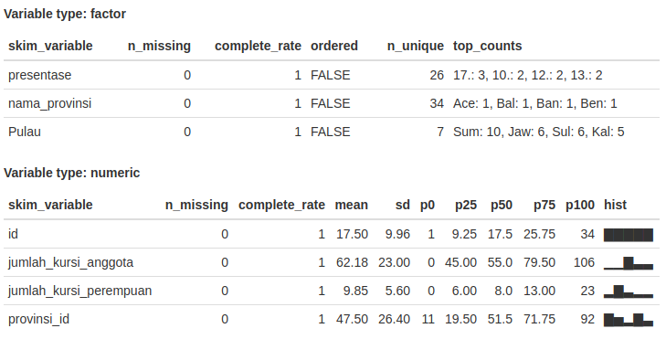

```{r setup, include=FALSE}
knitr::opts_chunk$set(echo = TRUE)
```

# Inspeksi Data

Inspeksi adalah pemeriksaan secara detail dan cermat terhadap suatu objek apakah sesuai atau tidak dengan aturan dan standar yang telah ditetapkan. Jadi inspeksi data adalah pemeriksaan data secara detail.

### Import Data

```{r import data}
prop_pr <- read.csv('data/Proporsi Perempuan DPR.csv', stringsAsFactors = T)
```

### Melihat awalan data

Gunakan fungsi head(nama_data, jumlah). Jika jumlah di kosongkan, secara default akan bernilai 6.

```{r 6 data awal}
# 6 data awal
head(prop_pr)
```

Output di atas menampillkan 6 data pertama

```{r 10 data awal}
# 10 data awal
head(prop_pr, 10)
```

Output di atas menampilkan 10 data pertama

### Melihat data akhir

Kebalikan dari head(), tail(nama_df, jumlah) digunakan untuk melihat data dari akhir.

```{r tail data}
# 6 data terkahir
tail(prop_pr)
```

### Menampilkan seluruh data

Untuk melihat seluruh data, gunakan fungsi View(nama_df). Tapi cara ini kurang direkomendasikan apalagi jika data berukuran besar.

    View(prop_pr)

### Melihat dimensi data

Melihat jumlah baris dan kolom dapat menggunakan fungsi berikut

```{r dim}
dim(prop_pr)
```

34 adalah jumlah baris dan 7 adalah jumlah variabel/kolom

### Melihat struktur data

```{r str}
str(prop_pr)
```

Berdasarkan output di atas kita mendapatkan gambaran data tentang jumlah observasi, variabel, dan tipe data. Dapat dilihat variabel jumlah_kursi_anggota bertipe int (integer/angka). Apakah ada yang mengganjal dari struktur data diatas?

### Summary data

Melihat statistik deskriptif data

```{r summary data}
summary(prop_pr)
```

Nilai yang diperoleh terdiri dari nilai minimum, quartil, mean dan nilai maksimum untuk tipe variabel int. Adapun untuk tipe data factor akan dihitung jumlah factor pada data. Contoh pada variabel Pulau, "Jawa : 6" artinya terdapat 6 data yang merupakan provinsi di pulau jawa.

### Summary data yang lebih lengkap

Jika anda merasa fungsi summary() masih kurang menampilkan statistik deskriptif data, untuk melihat statistik deskriptif yang lebih lengkap kita dapat menggunakan fungsi skim pada library skim.

    # install library jika belum tersedia
    install.packages('skimr') #cukup sekali install

```
#load library
library(skimr)
skim(prop_pr)
```


Dapat dilihat output skim lebih lengkap dibanding dibanding summary()

### Plot Data

Kita akan membuat histogram jumlah_kursi_perempuan di DPR

```{r plot dpr}
hist(prop_pr$jumlah_kursi_perempuan)
hist(prop_pr$jumlah_kursi_anggota)
```
Pada output di atas diketahui bahwa jumlah kursi perempuan DPR berkisar antara 5-10 kursi, sedangkan kursi total kursi anggota berkisar antara 40-60 kursi.


### Mengapa inpeksi data penting?

Pada kenyataannya tidak semua data siap untuk di olah, kebanyakan data harus di manipulasi bentuknya terlebih dahulu. Dengan menginspeksi data kita mengetahui anomali pada data, seperti kesalahan tipe data, data kosong nama variabel yang tidak sesuai dan sebagainya. Contoh data yang kotor:

```{r kotor data}
data_pilpres <- read.csv('data/Hasil Pilpres 2014.csv', stringsAsFactors = T)
str(data_pilpres)
```
Apa yang salah dari data di atas?
Variabel jumlah_suara dan presentase yang merupakan angka dibaca sebagai tipe factor. Hal yang menyebabkan ini adalah tanda titik "." pada jumlah suara dan tanda koma "," dan  persen "%" pada variabel presentase. 

Jika kita paksa membuat hist untuk data jumlah_suara, sudah pasti akan error.

```
hist(data_pilpres$jumlah_suara)
Error in hist.default(data_pilpres$jumlah_suara) : 'x' must be numeric
```

Mengetahui anomali data, berarti kita langkah apa yang kita harus lakukan, yakni menghapus tanda "., "," dan "%".

#### Mengubah struktur dan tipe data

```{r ubah str}
library(stringr) #library untuk manipulasi string
# menghapus tanda . (titik) pada jumlah suara
data_pilpres$jumlah_suara <- str_replace_all(data_pilpres$jumlah_suara, "[[:punct:]]", "")

#mengganti tanda , (koma) menjadi tanda . (titik)
data_pilpres$presentase <- str_replace_all(data_pilpres$presentase, ",", ".")

#menghapus tanda % (persen)
data_pilpres$presentase <- str_replace_all(data_pilpres$presentase, "%", "")
str(data_pilpres)
```
Pada output di atas tanda titik "." pada variabel jumlah_suara sudah hilang. Begitupn pada variabel presentase tanda "," telah diganti menjadi "." dan tanda "%" sudah di hapus. Selanjutnya ubah tipe data ke integer/numeric


```{r tipe data}
data_pilpres$jumlah_suara <- as.numeric(data_pilpres$jumlah_suara)
data_pilpres$presentase <- as.numeric(data_pilpres$presentase)
data_pilpres$pasangan <- as.factor(data_pilpres$pasangan)
data_pilpres$nama <- as.factor(data_pilpres$nama)
str(data_pilpres)
head(data_pilpres,7)
```

Akhirnya data telah bersih dan siap untuk di olah


```{r hist suara}
hist(data_pilpres$jumlah_suara, breaks = 100)
```


