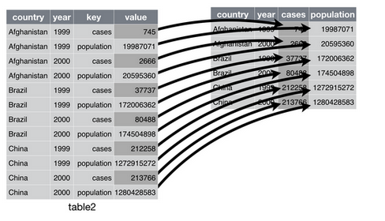
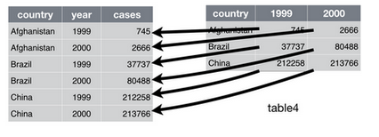

```{r setup, include=FALSE}
knitr::opts_chunk$set(echo = TRUE)
```

## Dplyr

Dplyr adalah package di R yang dapat digunakan untuk memanipulasi data. Package ini dikembangkan oleh Hadley Wickham dan Roman Francois yang memberikan beberapa fungsi yang mudah digunakan. Package ini sangat berguna ketika digunakan untuk melakukan analisis dan eksplorasi data.


install oackages dplyr atau tidyverse terlebih dahulu jika paket belum tersedia.

install.packages('dplyr') \#mengistall packages dplyr

install.packages('tidyverse') \#menginstall packages tidyverse

```{r load library}
#load library
library(dplyr)
```

### Buat data seperti di bawah dengan kode R dan beri nama data_latihan

```{r data_latihan}
data_latihan <- data.frame(
    merk = factor(c('Realme', 'Vivo', 'Vivo', 'Realme', 'Xiaomi','Vivo', 
                    'Realme', 'Xiaomi', 'Xiaomi')),
    nama_barang = factor(c('Realmi C15', 'Vivo y20', 'Vivo y30', 'Realme C11', 'Xiaomi Redmi9',
                           'Vivo y50', 'Realmi 7i', 'Xiaomi Mi 9T', 'Xiaomi 6x')),
    harga = c(1890000, 1619900, 2249000, 1540000, 1699000, 3499000, 2798900, 4851000, 2199000),
    penjualan_2016 = c(3, 1, 14, 11, 14, 14, 14, 12, 12),
    penjualan_2017 = c(5, 4, 9, 9, 4, 9, 9, 8, 6),
    penjualan_2018 = c(13, 10, 7, 1, 7, 10, 8, 13, 6),
    penjualan_2019 = c(15, 6, 3, 3, 8, 9, 15, 14, 10)
)

```

### Melihat dimensi data

```{r dimensi data}
dim(data_latihan)
```

### Melihat 6 data pertama

```{r head_data}
head(data_latihan)
```

### Melihat strukur data

```{r str_data}
str(data_latihan)
```

Dari output di atas dapat diperoleh beberapa informasi, seperti type object data_latihan yaitu data.frame, berisi 9 observasi dan 7 variabel, yaitu merk, nama_barang, harga dan seterusnya.

## Select

Digunakan untuk menyeleksi kolom data

```{r select}
data_2016 <- data_latihan %>%
    select(nama_barang, penjualan_2016)
data_2016
```

### Latihan

Coba pilih variabel data nama_barang, penjualan 2018 hingga 2019

## Filter
Menyaring baris data berdasarkan kondisi tertentu

### Filter harga barang \> 2jt

```{r filter}
filter_2jt <- data_latihan %>%
    filter(harga > 2000000)
filter_2jt
```

### Latihan

Filter data dengan harga diatas 2jt dibawah 3jt

```{r}
```

### Jawaban

```{r jawaban filter}
filter_2jt <- data_latihan %>%
    filter(harga > 2000000) %>%
    filter(harga < 3000000)
filter_2jt
```

Filter hanya merk Vivo

```{r filter merk}
data_latihan %>%
    filter(merk == 'Vivo')
```

## Group_by dan Summarise

Kedua fungsi ini sering digunakan bersamaan, group digunakan untuk mengelompokkan data dan summarise digunakan untuk agregasi data

Contoh hitung rata-rata harga handphone berdasarkan merk

```{r group_by}
group_data <- data_latihan %>%
    group_by(merk) %>%
    summarise(rata_rata_harga = mean(harga))
group_data              
```

Visualisasi harga barang (visualisasi akan dibahas di pertemuan lain)

```{r visualisasi harga1}
library(ggplot2)
ggplot(group_data, aes(merk, rata_rata_harga)) +
    geom_bar(stat = 'identity')
```

```{r visualisasi harga2}
ggplot(group_data, aes(merk, rata_rata_harga, fill=merk)) +
    geom_bar(stat = 'identity')
```

## Arrange

Mengurutkan data, misal ingin mengurutkan smartphone dari termurah ke termahal

```{r arrange}
arrange_data_min <- data_latihan %>%
    arrange(harga)
arrange_data_min
```

Mengurutkan data, dari termahal ke murah

```{r arrange2}
arrange_data_max <- data_latihan %>%
    arrange(desc(harga))
arrange_data_max
```

## Mutate

Utuk membuat kolom baru berdasarkan operasi yang dilakukan pada kolom data yang lain.

Contoh hitung buat kolom pendapatan 2016, dengan mengalikan harga dan penjual_2016

```{r mutate}
mutate_data <- data_latihan %>%
    mutate(pendapatan_2016 = harga * penjualan_2016)
mutate_data
```

## Referensi

    https://muhammadilhammubarok.wordpress.com/2018/05/01/manipulasi-data-dengan-librarydplyr-di-r/ 

    https://rpubs.com/arumprimandari/368022

## Data Tidying

<https://garrettgman.github.io/tidying/>

Bentuk manipulasi selanjutnya adalah mengorganisir bentuk data

ada 4 fungsi yang sering digunakan

### Spread()



### gather()



### separate()

memisahkan kolom

### unity

menggabungkan kolom

### Melihat ulang data

```{r head_mutate}
head(mutate_data)
```

Memilih semua variabel kecuali variabel pendapatan_2016 dan melihat 6 data terakhir

```{r}
tidying_data <- mutate_data %>%
    select(!pendapatan_2016)
tail(tidying_data)
```

Mengganti nama kolom

```{r ganti nama kolom}
colnames(tidying_data) <- c('merk', 'nama_barang', 'harga', '2016', '2017', 
                            '2018', '2019')
head(tidying_data)
```

### Gather

```{r gather}
library(tidyr)
gather_data <- tidying_data %>%
    gather('tahun', 'penjualan', 4:7)
head(gather_data)
```

```{r tail}
tail(gather_data)
```

Variabel 2016-2019 digabung menjadi satu di variabel tahun dan nilai-nilainya di simpan di variabel penjualan

### Spread

Kebalikan dari gather

```{r spread}
spread_data <- gather_data %>%
    spread(tahun, penjualan)
tail(spread_data)
```

Data kembali ke bentuk semula

### Penerapan

Contoh penggunaan kita ingin membuat plot line berbandingan penjualan dari tahun 2016-2019 sesuai data di atas, agar fungsi ggplot dapat membuat plot tersebut, data spread di atas harus di susun (manipulasi) bentuknya agar sesuai dengan yang di inginkan fungsi ggpplot

```{r penerapan}
line_data <- gather_data %>% 
    group_by(merk, tahun) %>%
    summarise(total = sum(penjualan))
line_data$tahun <- as.factor(line_data$tahun)
ggplot(line_data, aes(x = tahun, y= total, group = merk)) + geom_line(aes(color=merk)) +
  geom_point(aes(x = tahun, y= total))
```

### Unite

Menggabung beberapa kolom menjadi satu kolom

```{r unite}
head(mutate_data)

unite_data <- mutate_data %>%
    unite('merk_nama', nama_barang, merk, sep = '/')
head(unite_data)
```

Dari output di atas terlihat kolom merk dan nama digabung menjadi variabel merk_nama

### Separate

```{r}
separate_data <- unite_data %>%
    separate(merk_nama, into=c('nama_barang', 'merk'), sep = '/')
head(separate_data)
```

Kebalikan dari unite, separate membagi kolom menjadi beberapa kolom, sebagai contoh variabel merk_nama di bagi menjadi menjadi variabel nama_barang dan merk menggunakan separator pemisah '/'. Sehingga Realmi C15/Realme akan menjadi Realmi C15 dan Realme
