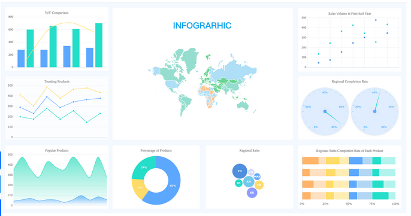

```{r setup, include=FALSE}
knitr::opts_chunk$set(echo = TRUE)
```

# Visualisasi Data

Singkatnya, visualisasi data dipakai untuk mempresentasikan data yang terstruktur ataupun tidak dengan grafik. Tujuan utama dari visualisasi data adalah untuk mengkomunikasikan informasi secara jelas dan efisien kepada pengguna lewat grafik informasi.



R memiliki library untuk visualisasi, baik fungsi  built in, ggplo2, plotly, highcharter dan lain-lain.

# Ggplot2

