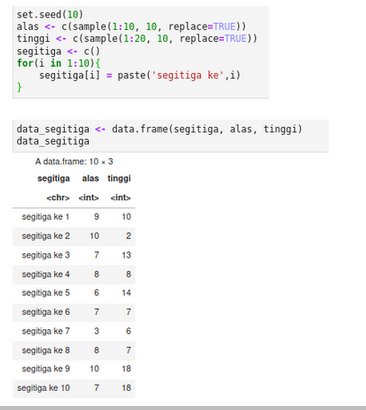
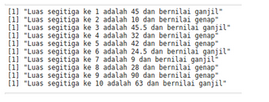

#### Tugas fungsi, perulangan dan percabangan

Buat fungsi untuk menghitung luas segitiga

Bangkitkan data alas dan tinggi

Hitung luas masing-masing segitiga dan kategorikan luas segitiga sebagai bilangan ganjil atau genap, gunakan fungsi, perulangan dan percabangan

Hasil akhir yang diharapkan seperti ini

## Selamat mencoba 